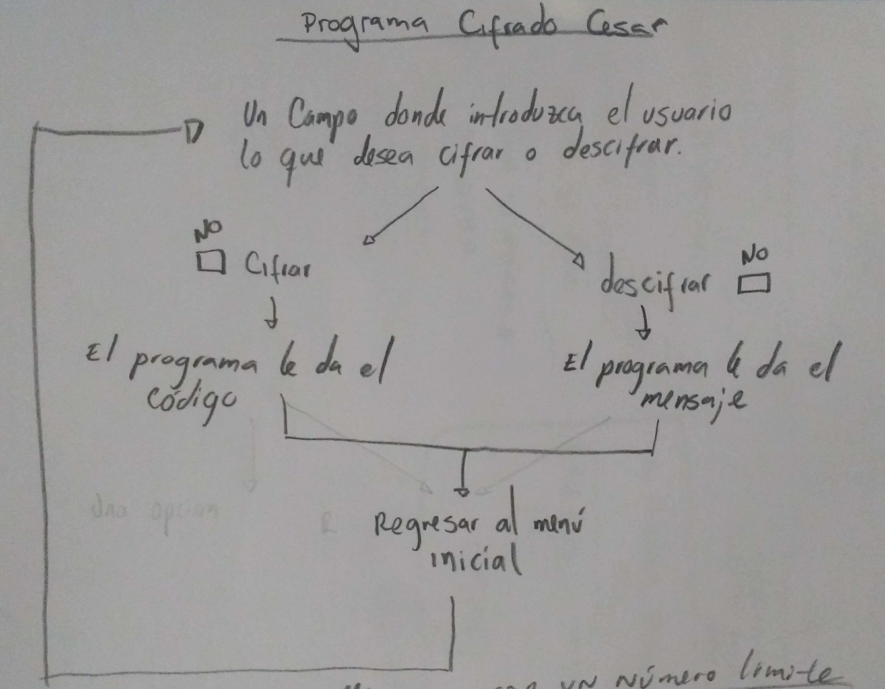
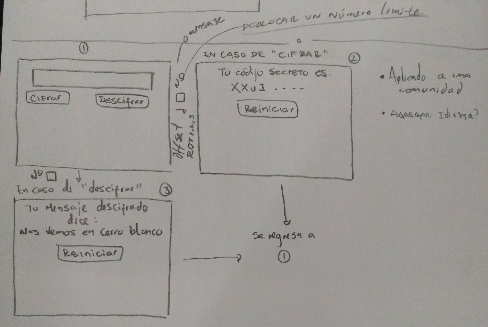
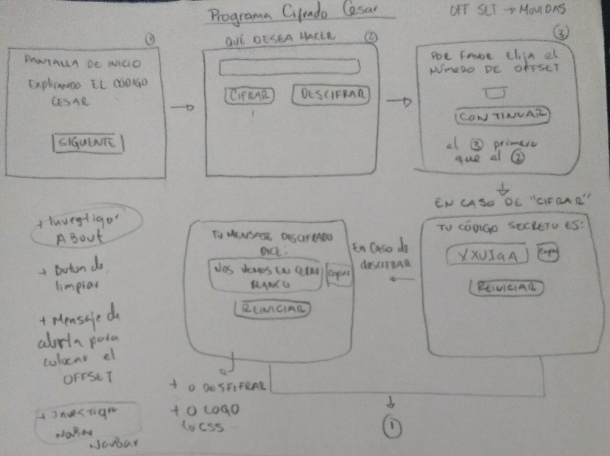
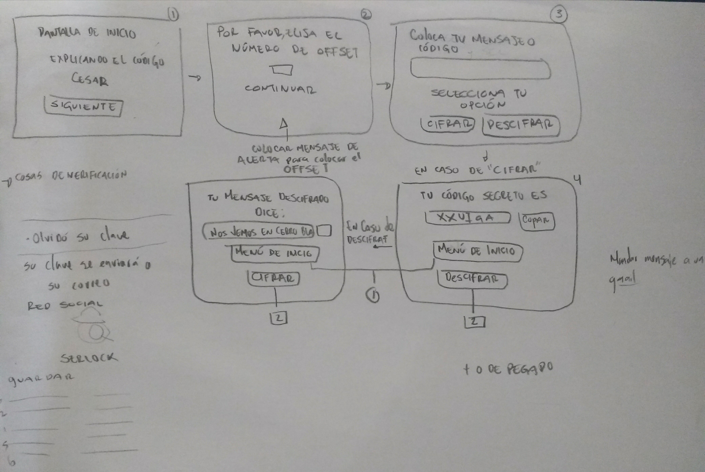
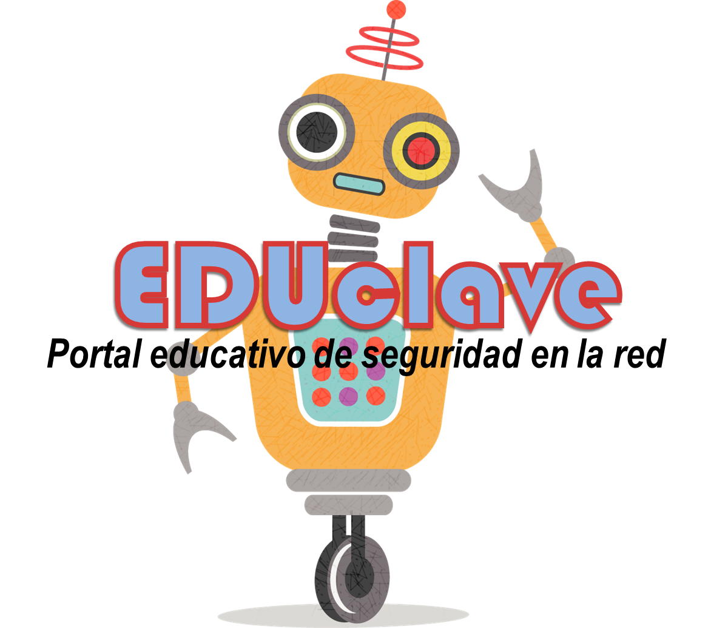
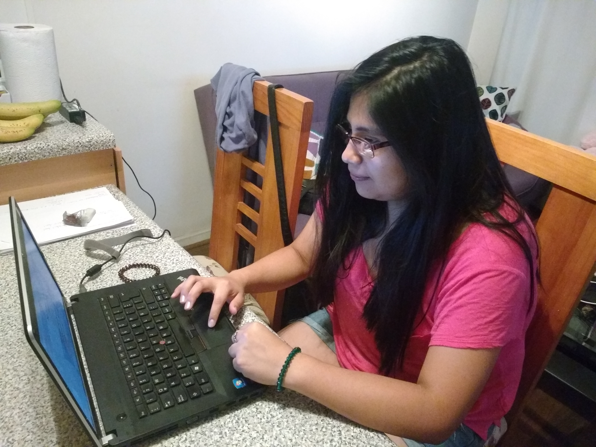
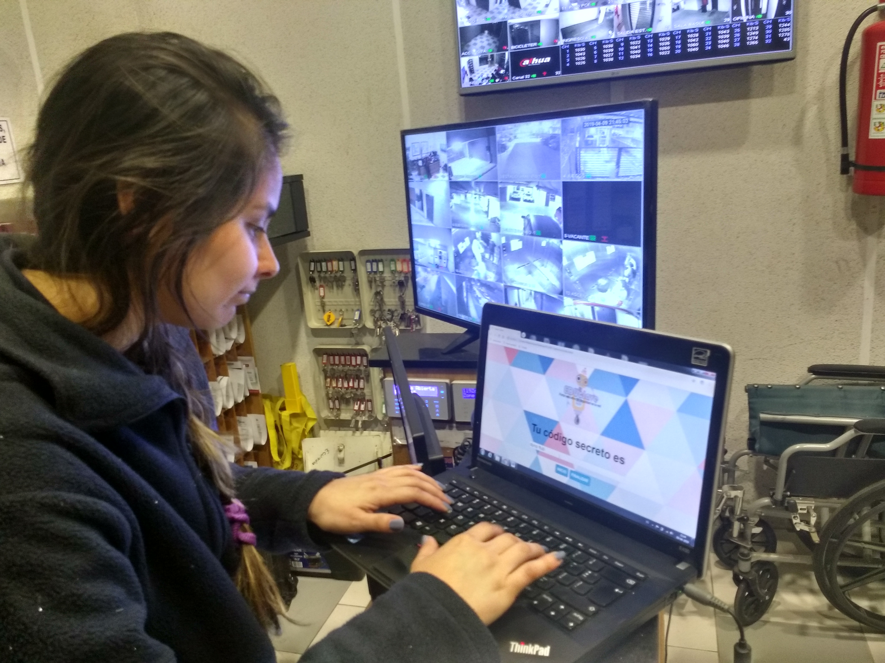
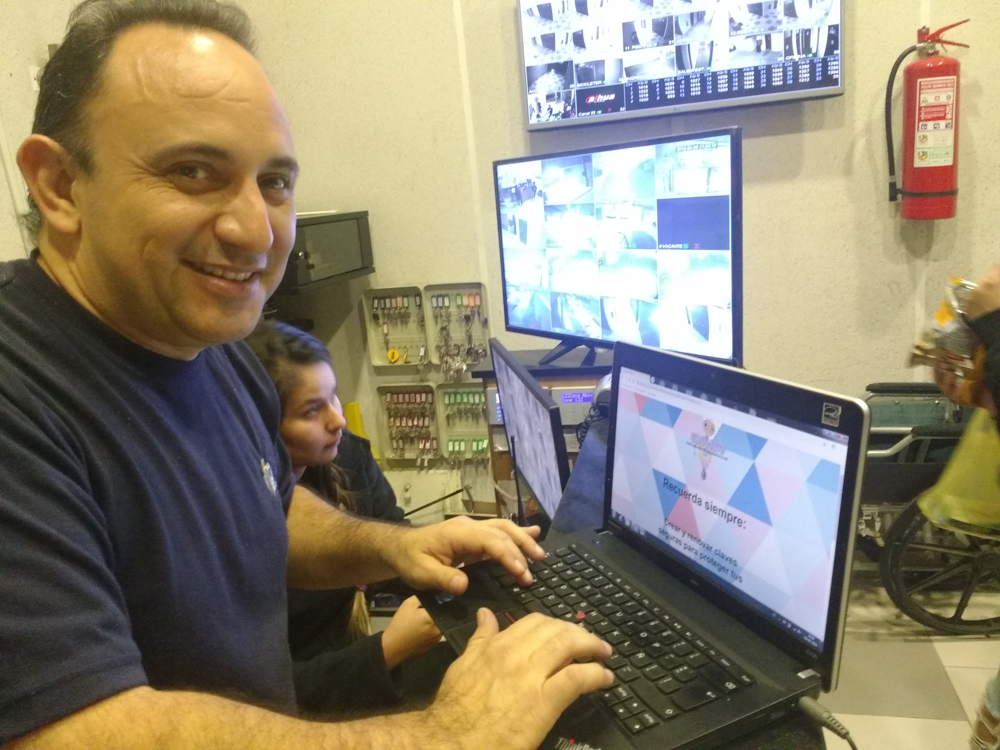
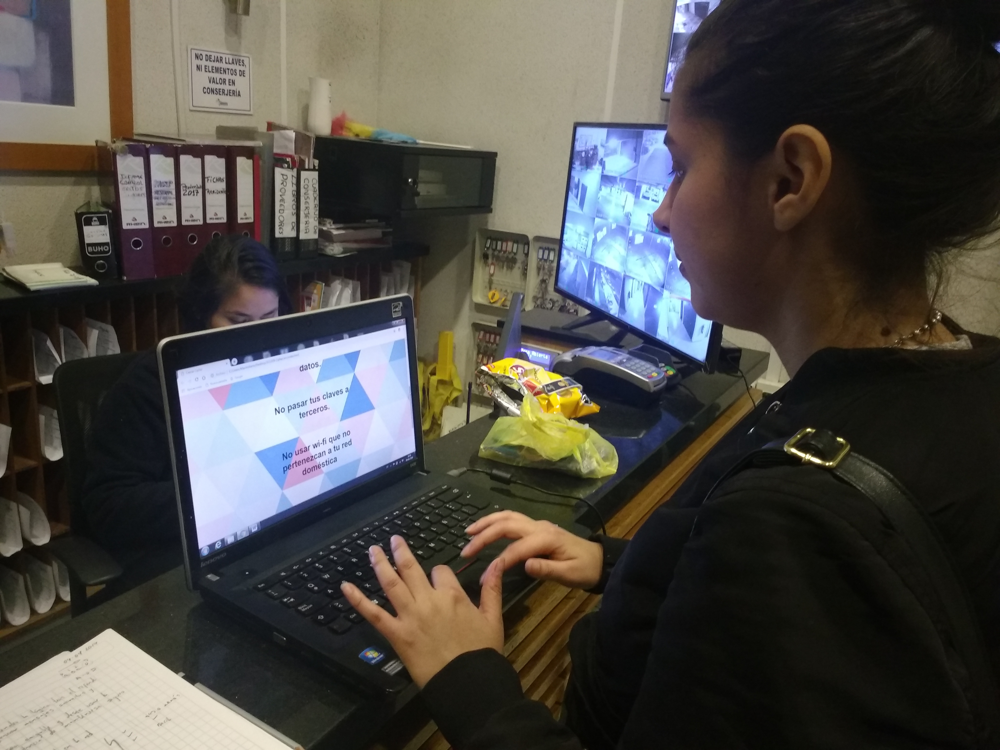
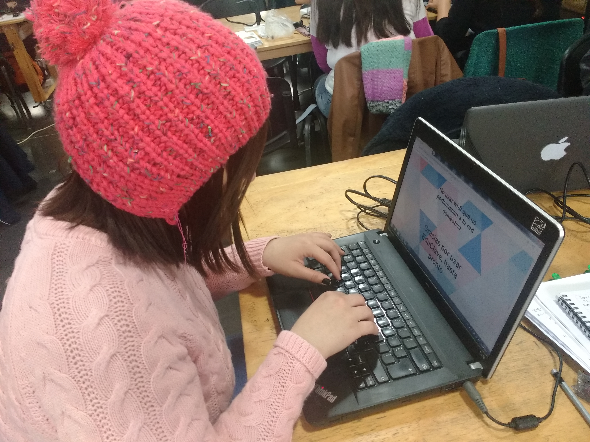

# CIFRADO CESAR, EDUCLAVE

## Proceso de diseño

Originalmente se deseaba crear un programa que cifrara y descifrara letras en mayúsculas y que pudiera mostrar ese resultado. Después de realizada algunas de las dos tareas, redireccionaría al usuario al menú de inicio.

Imagen 1. Diagrama de flujo del programa.

Se continuó con un dibujo de cómo se verían las diferentes pantallas a medida que el usuario avanzara. Una pantalla inicial mostraría un campo para que el usuario insertara el texto, para luego seleccionar si deseaba cifrarlo o descifrarlo. Luego, aparecería otra pantalla donde marcaría el desplazamiento u offset. Finalmente, una última pantalla donde se mostraría su resultado.

Imagen 2. Pantallas del programa.

Se realizaron dos feetback. En el primero, se me sugirió colocar una pantalla de inicio donde se explicaría al usuario sobre qué es el código cesar.  También, se me sugirió colocar un botón de copiar texto cuando el mensaje cifrado o descifrado estuviera listo.

Imagen 3. Pantallas del programa después del feetback uno.

Durante el segundo feetback. Vi flujos donde se colocaba el offset antes de preguntar el cifrado o descifrado y botones para limpiar el campo al momento de que el usuario colocara el texto. Me sugirieron también colocar un logo cuando tuviera el tema adecuado para el producto.

Imagen 4. Pantallas del programa después del feetback dos.

## Decisiones de diseño

Con respecto al diseño, decidí finalmente que mostraría una pantalla de inicio explicando el cifrado cesar. Con un botón de siguiente, me llevaría a la pantalla donde se le preguntaría al usuario el número de desplazamiento y por medio de un input que iniciaría desde el uno en adelante él pudiera seleccionarlo. Seguidamente, con un botón de continuar, llevaría a la pantalla donde se le pide al usuario que ingrese el mensaje o código y por medio de tres botones él decidiera: 1. Limpiar el campo, 2. Cifrar o 3. Descifrar. Al presionar cifrar o descifrar, llevaría a la pantalla donde se mostraría el resultado, según elección. En esa pantalla podría tomar la opción de ir a la pantalla de preguntar el offset o ir a la pantalla de despedida para salir del flujo del programa.
Ahora seguiría el siguiente paso, escribir los “to do” para empezar a crear el código. A continuación, el url para ir a mi Trello: 

[MiTrello](https://trello.com/b/qyVr5Uxp/programa-c%C3%B3digo-cesar)

El tema que elegí para mi producto digital fue una página educativa sobre seguridad de redes. La seguridad de redes comprende las políticas y prácticas para prevenir y supervisar el acceso no autorizado, el uso indebido, la modificación o denegación de una red informática y sus recursos. En este apartado en particular, se trata de iniciar al usuario sobre la generación de claves para la creación de accesos autorizados y que la persona entienda que los códigos y mensajes cifrados son elementos que se han usado a lo largo de la historia. Por medio del cifrado cesar se puede entender la lógica en la creación de estos usando una interfaz didáctica e interactiva.
Por último, se diseñó un logo acorde a la temática escogida.

Imagen 5. Logo del programa acorde a temática escogida.

## Quiénes son los usuarios
	
  Personas que usan claves seguras en su vida cotidiana, como puede ser los casos:

* Para realizar compras por internet.
*	para acceder a correos electrónicos u otra plataforma digital que la requiera.

## Objetivos del producto

*	Que el usuario pueda entender la lógica tras el cifrado.
*	El usuario pueda generar mensajes secretos y también pueda descifrarlos.
*	Que la interfaz le sea amigable y desee usarla nuevamente.
*	Que comprenda la importancia de mantenerse seguro en el mundo digital.

## Cómo mi producto soluciona las necesidades del usuario

Así como tomamos medidas de seguridad a la hora de salir a la calle, como puede ser: no colocar cosas de valor en los bolsillos externos del bolso o llevar tarjetas de crédito o débito en vez de dinero en efectivo. También debemos tener medidas de seguridad en el mundo digital, como por ejemplo: la generación de claves seguras, renovar estas cada cierto tiempo, no pasar nuestras claves a terceros, no usar wi-fi de terceros,  entre otras. Nuestro producto está orientado a que el usuario entienda está necesidad de resguardarse en el mundo digital.

## Guía de entrevista

Buenos días/ Buenas tardes, mi nombre es Marinés y estoy realizando un estudio de una plataforma educativa sobre seguridad en la red. ¿Sabe algo sobre seguridad en la red, a qué va referido? (si la persona no sabe, se le explica de manera muy sencilla y corta. Por ejemplo: Así como tomamos medidas de seguridad a la hora de salir a la calle, como puede ser, no colocar cosas de valor en los bolsillos externos del bolso. También debemos tener medidas de seguridad en el mundo digital, como puede ser cambiar nuestras claves de las tarjetas cada cierto tiempo).
Preguntarle al usuario si posee correo electrónico o si es poseedor de alguna tarjeta de banco (esto para saber si maneja diariamente claves seguras).
La plataforma que le mostraré a continúa aún está en construcción y sería de gran aporte sus comentarios. En ningún momento se le va a evaluar, no hay respuestas correctas o incorrectas. Sólo queremos una opinión honesta.

Esta es nuestra plataforma (acá comienzan las tareas):

1.	Que el usuario pueda asimilar que es el cifrado cesar.
2.	Que el usuario seleccione el desplazamiento, y escoja cifrar o descifrar.
3.	Que el usuario considere la importancia de mantenerse seguro en la red y tenga un comportamiento más responsable al respecto  

Gracias por participar. Me gustaría saber si tiene algún comentario final en referencia a la plataforma (Intentar, en este apartado final, que la persona haga comentarios que estén dirigidos a las tareas/objetivos).

A continuación, el enlace al programa:
[EduCLave](https://marineslemus007.github.io/SCL009-Cipher/src/index.html)

## Sesiones de testing

Usuario: Caren

Posee correo y tarjetas bancarias

Caren manifiesta haber entendido la lógica del cifrado. Pudo crear mensajes secretos en la plataforma. Se le hizo fácil manipular la interfaz y considera cambiar sus claves cada cierto tiempo.

Imagen 6. Usuario número uno.

Usuario: Yajaira

Posee correo y tarjeta bancaria

Yajaira manifiesta que le falta practicar un poco más con el programa para entender la lógica del cifrado y descifrado. Pudo crear mensajes secretos en la plataforma. Se le hizo fácil manipular la interfaz y considera cambiar sus claves cada cierto tiempo.

Imagen 7. Usuario número dos.

Usuario: Edwar

Posee correo y tarjeta bancaria

Edwar manifiesta no entender muy bien la lógica del cifrado y descifrado. Pudo crear mensajes secretos en la plataforma. Se le hizo sencillo manipular la interfaz y también consideraría cambiar sus claves cada cierto tiempo.

Imagen 8. Usuario número tres.

Usuario: Hayde

Posee correo y tarjeta bancaria

Hayde pudo entender muy rápido la lógica del cifrado y descifrado. Creo mensajes secretos en la plataforma. Se le hizo sencillo manipular la interfaz y consideraría cambiar sus claves cada cierto tiempo.

Imagen 9. Usuario número cuatro.

Usuario: Betányeli

Posee correo y tarjeta bancaria

Betányeli comprendió la lógica del cifrado y descifrado. Pudo crear mensajes secretos en la plataforma. Se le hizo sencillo manipular la interfaz y consideraría tomar medidas de seguridad para protegerse en el mundo digital.

Imagen 10. Usuario número cinco.